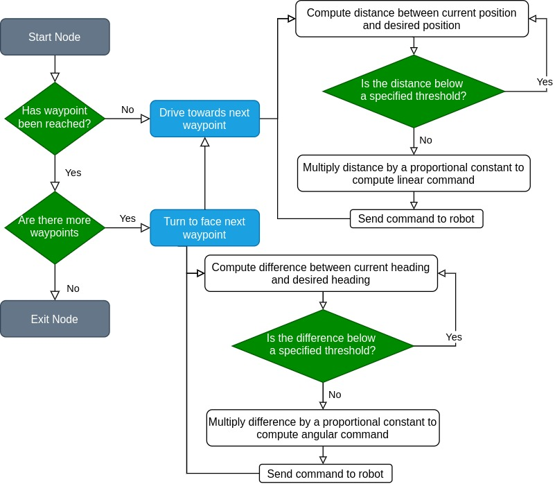
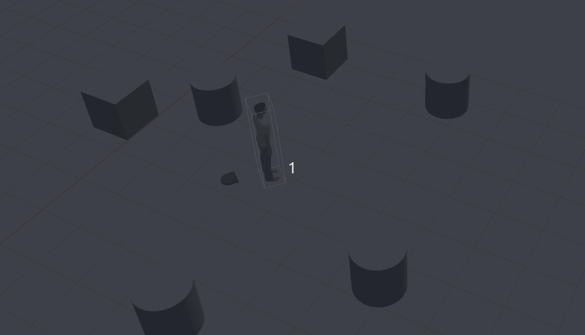

# Warmup Project
This is the repo for the 2020 CompRobo warmup project

# Dependencies
+ https://github.com/kam3k/laser_line_extraction
+ python inputs package
+ https://github.com/eric-wieser/ros_numpy

## Robot Teleop
For the robot teleop, I used the [inputs](https://github.com/zeth/inputs) python package to read input from a joystick. Every button press and axis movement triggered an "event," which was regularly checked for in the node's main loop.

At first, an issue I ran into was the input appeared to be significantly delayed - when pressing a button, I wouldn't notice a change in values until seconds after I had pressed it. This was solved by increasing the node's update rate so that it "flushed out" the queue of detected events and provided the most up-to-date data at any given time.

With more time, this teleop could be improved with the incorporation of different types of scaling (linear, logarithmic), and by implementing a threshold for minimum difference between commands before sending a new command (right now it publishes commands at a very high rate, which would be suboptimal if limiting bandwidth was a consideration)

## Square Driver

For the square driver, I wrote a generalized waypoint navigation node that drives the robot to a list of points. When a robot reaches a waypoint, it turns to face the next waypoint before driving towards it. The process can be described with the following flow chart

To get the current position and orientation of the robot, I used the odometry message on `/odom`. The current heading was computed by taking the cosine of the dot product between the two vectors. Since the "direction" of the difference was important, I used the sign of the vectors' cross product for the final computation.  

<!-- For each behavior, describe the problem at a high-level. Include any relevant diagrams that help explain your approach.  Discuss your strategy at a high-level and include any tricky decisions that had to be made to realize a successful implementation.
For the finite state controller, what was the overall behavior. What were the states? What did the robot do in each state? How did you combine and how did you detect when to transition between behaviors?  Consider including a state transition diagram in your writeup.
How was your code structured? Make sure to include a sufficient detail about the object-oriented structure you used for your project.
What if any challenges did you face along the way?
What would you do to improve your project if you had more time?
What are the key takeaways from this assignment for future robotic programming projects? For each takeaway, provide a sentence or two of elaboration. -->

## Wall Follower

+ External package to compute line segments
+ compute distance to nearest line segment
+ drive towards nearest line segment
+ compute heading difference between robot and line segment
+ put into proportional loop

# TODO:
- implement wall detection
- writeup
- Create visualizations and rosbag files for implementations

## Person Follower

+ Uses DBSCAN clustering to cluster 2D data from lidar
+ Computes nearest cluster
+ Uses proportional control to control position and velocity when approaching person
+ attempted to use convex hull to compute area of object, but this implementation was brittle due to "lidar shadows"

## Remarks
How was your code structured? Make sure to include a sufficient detail about the object-oriented structure you used for your project.
What if any challenges did you face along the way?
What would you do to improve your project if you had more time?
What are the key takeaways from this assignment for future robotic programming projects? For each takeaway, provide a sentence or two of elaboration.

+ namespaces are a mess
