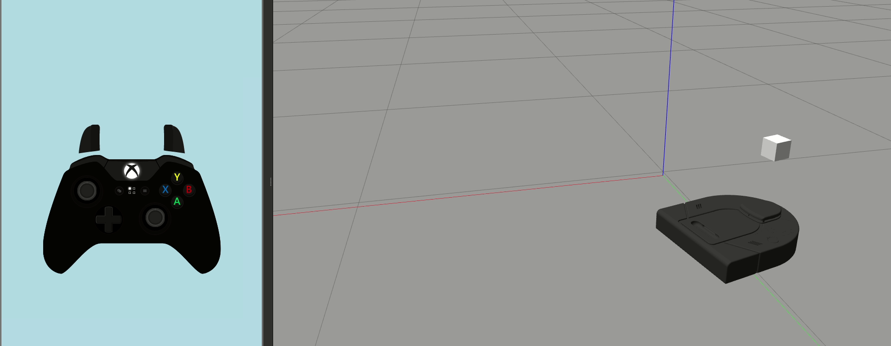
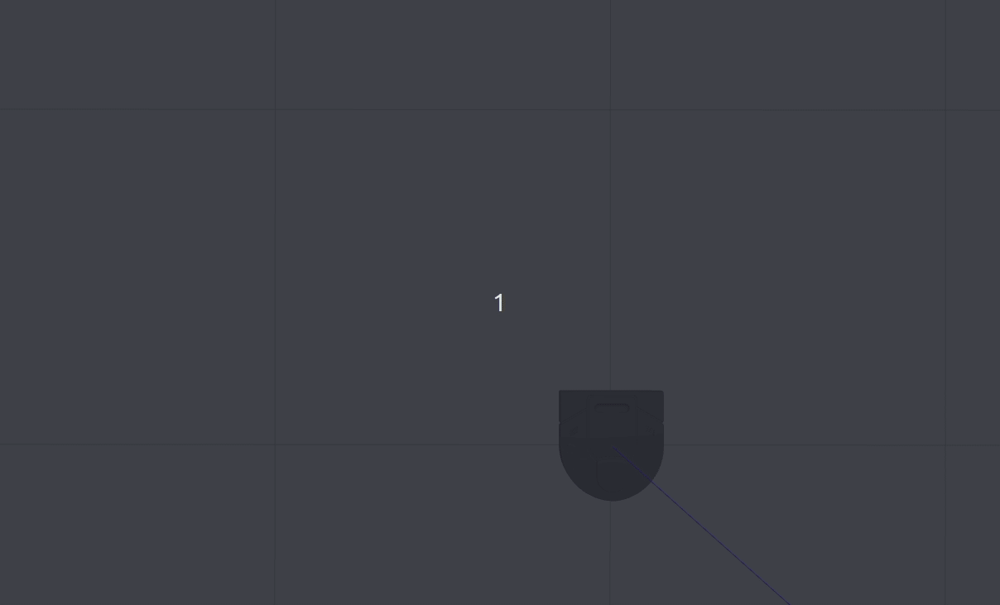
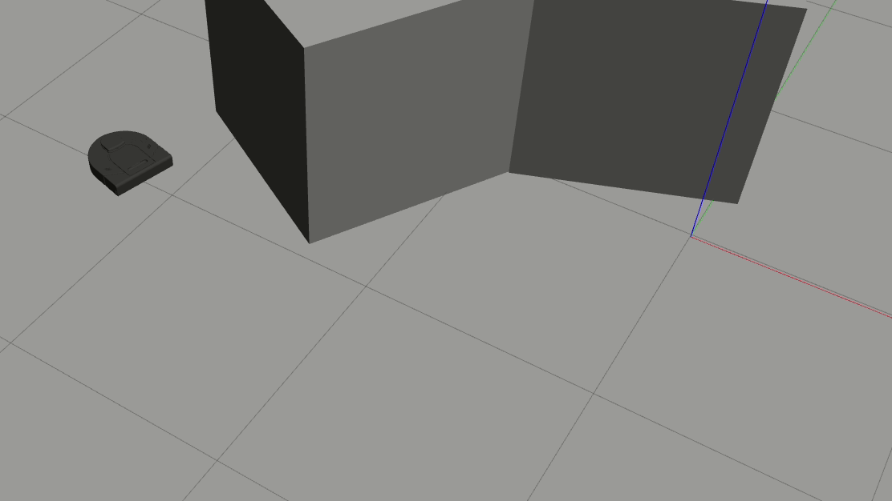

# warmup_project
This is the base repo for the Olin Computational Robotics warmup project.

# Dependencies
https://github.com/kam3k/laser_line_extraction

## Robot Teleop
For the robot teleop, I used the [inputs](https://github.com/zeth/inputs) python package to read input from a joystick. Every button press and axis movement triggered an "event," which was regularly checked for in the node's main loop.

At first, an issue I ran into was the input appeared to be significantly delayed - when pressing a button, I wouldn't notice a change in values until seconds after I had pressed it. This was solved by increasing the node's update rate so that it "flushed out" the queue of detected events and provided the most up-to-date data at any given time.

## Square Driver
<!-- TODO: Create visualization of square -->

Used `/odom`, generalized p2p navigation with proportional control. Position tolerance during waypoint following

For each behavior, describe the problem at a high-level. Include any relevant diagrams that help explain your approach.  Discuss your strategy at a high-level and include any tricky decisions that had to be made to realize a successful implementation.
For the finite state controller, what was the overall behavior. What were the states? What did the robot do in each state? How did you combine and how did you detect when to transition between behaviors?  Consider including a state transition diagram in your writeup.
How was your code structured? Make sure to include a sufficient detail about the object-oriented structure you used for your project.
What if any challenges did you face along the way?
What would you do to improve your project if you had more time?
What are the key takeaways from this assignment for future robotic programming projects? For each takeaway, provide a sentence or two of elaboration.

## Wall Follower

# TODO:
- implement wall detection
