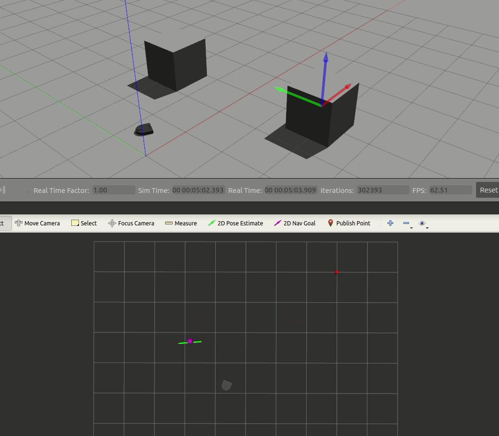
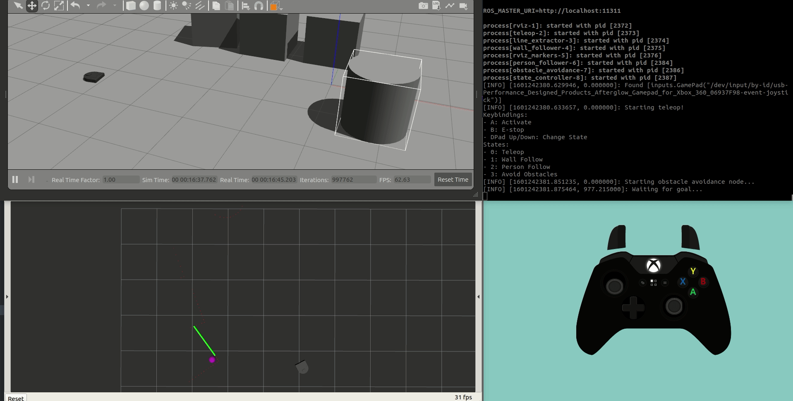
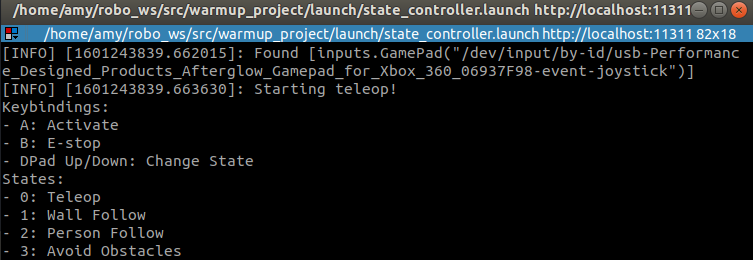

# Warmup Project
This is the repo for the 2020 CompRobo warmup project

# Dependencies
+ https://github.com/kam3k/laser_line_extraction
+ python inputs package
+ https://github.com/eric-wieser/ros_numpy

## Robot Teleop
For the robot teleop, I used the [inputs](https://github.com/zeth/inputs) python package to read input from a joystick. Every button press and axis movement triggered an "event," which was regularly checked for in the node's main loop.

At first, an issue I ran into was the input appeared to be significantly delayed - when pressing a button, I wouldn't notice a change in values until seconds after I had pressed it. This was solved by increasing the node's update rate so that it "flushed out" the queue of detected events and provided the most up-to-date data at any given time.


With more time, this teleop could be improved with the incorporation of different types of scaling (linear, logarithmic), and by implementing a threshold for minimum difference between commands before sending a new command (right now it publishes commands at a very high rate, which would be suboptimal if limiting bandwidth was a consideration)

## Square Driver


For the square driver, I wrote a generalized waypoint navigation node that drives the robot to a list of points. When a robot reaches a waypoint, it turns to face the next waypoint before driving towards it. The process can be described with the following flow chart


To get the current position and orientation of the robot, I used the odometry message on `/odom`. The current heading was computed by taking the cosine of the dot product between the two vectors. Since the "direction" of the difference was important, I used the sign of the vectors' cross product for the final computation.  


<!-- For each behavior, describe the problem at a high-level. Include any relevant diagrams that help explain your approach.  Discuss your strategy at a high-level and include any tricky decisions that had to be made to realize a successful implementation.
For the finite state controller, what was the overall behavior. What were the states? What did the robot do in each state? How did you combine and how did you detect when to transition between behaviors?  Consider including a state transition diagram in your writeup.
How was your code structured? Make sure to include a sufficient detail about the object-oriented structure you used for your project.
What if any challenges did you face along the way?
What would you do to improve your project if you had more time?
What are the key takeaways from this assignment for future robotic programming projects? For each takeaway, provide a sentence or two of elaboration. -->


## Wall Follower


#### Usage
+ `roslaunch warmup_project wall_follower.launch`

+ External package to compute line segments
+ compute distance to nearest line segment
+ drive towards nearest line segment
+ compute heading difference between robot and line segment
+ put into proportional loop

# TODO:
- implement wall detection
- writeup
- Create visualizations and rosbag files for implementations

## Person Follower


#### Usage
+ `rosrun warmup_project person_follower.launch`

+ Uses DBSCAN clustering to cluster 2D data from lidar
+ Computes nearest cluster
+ Uses proportional control to control position and velocity when approaching person
+ attempted to use convex hull to compute area of object, but this implementation was brittle due to "lidar shadows"

## Obstacle Avoidance


#### Usage
+ `roslaunch warmup_project obstacle_avoidance.launch`

At a high level, my obstacle avoidance implementation works by computing the optimal heading to get to the goal position, then adding in an adjustment based on detected objects in the lidar scan. Ultimately, the angular commands are computed in this line of code:
```
cmd.angular.z = self.k1*heading_offset + self.k2*obstacle_factor
```

To compute the heading offset, I took the difference between the neato's current heading according to `odom` and the angle of the vector between the neato's current position and the goal position in the `odom` frame.

To take into account the obstacles, I computed an "obstacle factor," which considered points within +/- 60 degrees of straight ahead. Since the lidar frame was rotated 180 degrees off of the robot frame, I first adjusted the ranges to make the frames point in the same orientation. For the points within this range, I took the sum of points weighted by both their angular position relative to the robot and distance from the robot. Points that were closer to the robot and were at smaller angles from dead ahead were given a larger weight than points further away and off to the sides. The pseudocode for computing this factor can be written as:
 ```
 obstacle_factor = 0

 for each point between -60 and 60 degrees:
     angle = angle of point w.r.t neato
     distance = distance of point from neato

     obstacle_factor += (1/distance) * 3*(1/angle)
 ```
(Note: The 3 in the code above is used to make the magnitude of the angle approximately equal to the distance so they have a similar effect on the factor value)

The constants `k1` and `k2` were then manually adjusted until the robot prioritized the goal enough to make it there without hitting any obstacles. When k1 was too high, the robot would hit obstacles en route to the goal. When k2 was too high, the robot would ignore the goal and just run away from obstacles.

To help smooth the movements out, the forward velocity command was proportional to the distance from the goal, with a hard limit applied to prevent excessively large or negative values.

This current implementation doesn't work particularly well if there's an obstacle dead ahead with the goal right behind it since it doesn't know whether it should turn left or right. As long as one side has a bit more weight than the other side, it works alright since the weights "snowball" as the robot turns (i.e. positive feedback loop).

#### Dynamic Window Approach
Before this implementation, I spent a lot of time looking into the path planning algorithm proposed by this paper https://github.com/goktug97/DynamicWindowApproach. This implementation works by "predicting" where the robot will be at a specified time step assuming different commands are sent, then computing various "costs" for each of the predicted positions. It attempts to minimize the distance to the goal, while maximizing speed without hitting obstacles). Whichever command that leads to the lowest predicted cost is then chosen for the robot.

In putting this implementation together, I struggled with keeping track of what frame the different measurements were in and converting back and forth between the frames as necessary. Ultimately, I ran out of time, but would be interested in revisiting this implementation at a later point. The unfinished code for this can be viewed in `obstacle_avoidance_dwa`.

## State Controller


#### Usage
+ `roslaunch warmup_project state_controller.launch`

For the state controller, I modified my teleop code to switch between the different behaviors. In order for the state controller code to know when to switch, I needed to modify the teleop code to publish the states of the relevant buttons. This required creating a new custom message type, which I called JoystickInput (note: the Joy ROS package does do something similar, but I wanted something more custom).
```
JoystickInput.msg

# Data for button presses on joystick. Reads True if button is pressed,
# False otherwise

# Button A state
bool a
# Button B state
bool b
# D-pad state
bool dpad_up
bool dpad_down
```
Since these controls are less intuitive than simply using the left joystick to drive the robot around, I added instructions to the teleop that prints on when the node starts up.


Instead of starting up all of the individual behaviors separately (i.e. teleop, wall following, etc.) I started all of them in the `state_controller.launch` launch file. However, since all of the nodes are attempting to publish to `/cmd_vel`, all of the topics needed to be remapped, which is also handled in the launch file. Looking back, I realize I've been fairly sloppy with my handling of namespaces - in some places, I use global topic names, and in others I properly use namespaces. While it works for the time being, this would be suboptimal in a larger project, and it's definitely something I'll be more cognizant of going forward.

This implementation could be improved by having a more elegant solution for adding & modifying states. With more time, I'd be interested in finding a way to use a configurable YAML file to define states instead of hardcoding them into the state controller code. It'd also be interested to look into using the bump sensor as an e-stop, regardless of what state the robot was currently in.

For a more extended demo of the full system, check out this video here:
https://youtu.be/hElzsvBRAto

## Remarks
How was your code structured? Make sure to include a sufficient detail about the object-oriented structure you used for your project.
What if any challenges did you face along the way?
What would you do to improve your project if you had more time?
What are the key takeaways from this assignment for future robotic programming projects? For each takeaway, provide a sentence or two of elaboration.

+ namespaces are a mess
